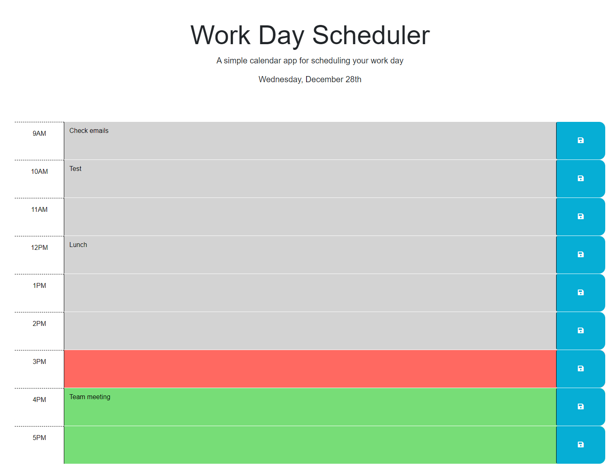

# Work Day Scheduler

## Description

Managing your work day can be challenging if you don't have a plan. Therefore, I created a simple calendar application that allows a user to save events for each hour of the day. Users can modify and reference the application during the day to keep them on track. I learned how to simplify my JavaScript by applying jQuery and how to use Day JS to add date and time functionality.

## Website Screenshot

## Published Website

https://dhoneck.github.io/work-day-scheduler/